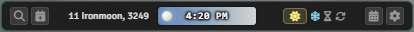
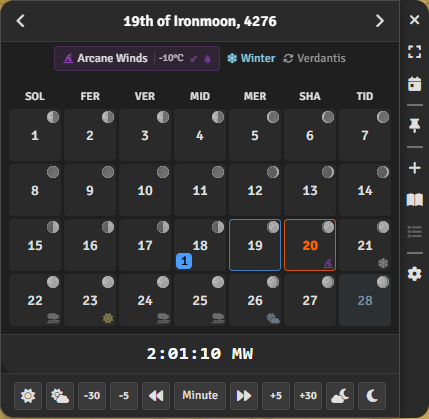
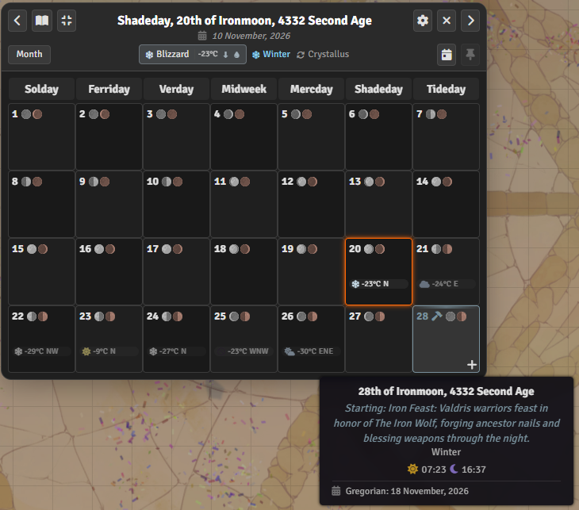
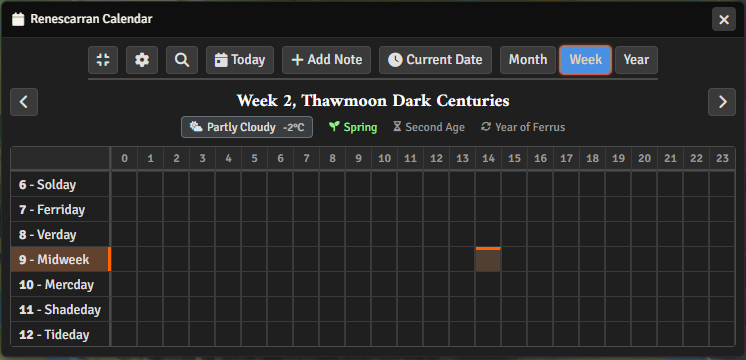
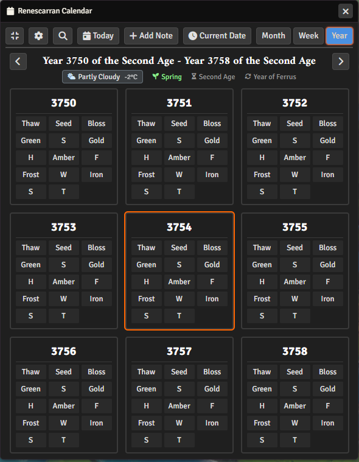
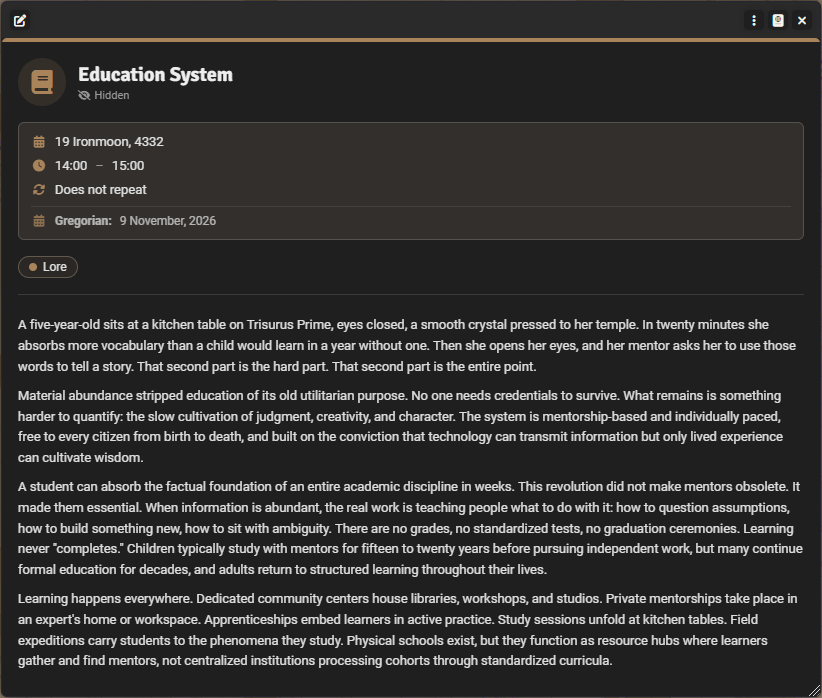
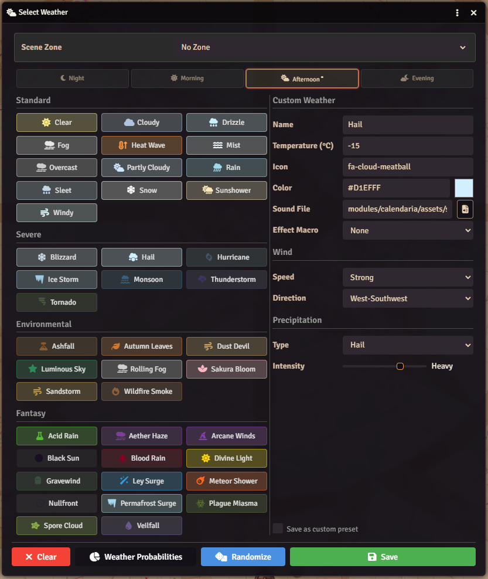
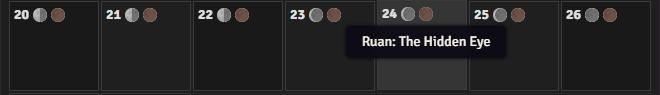
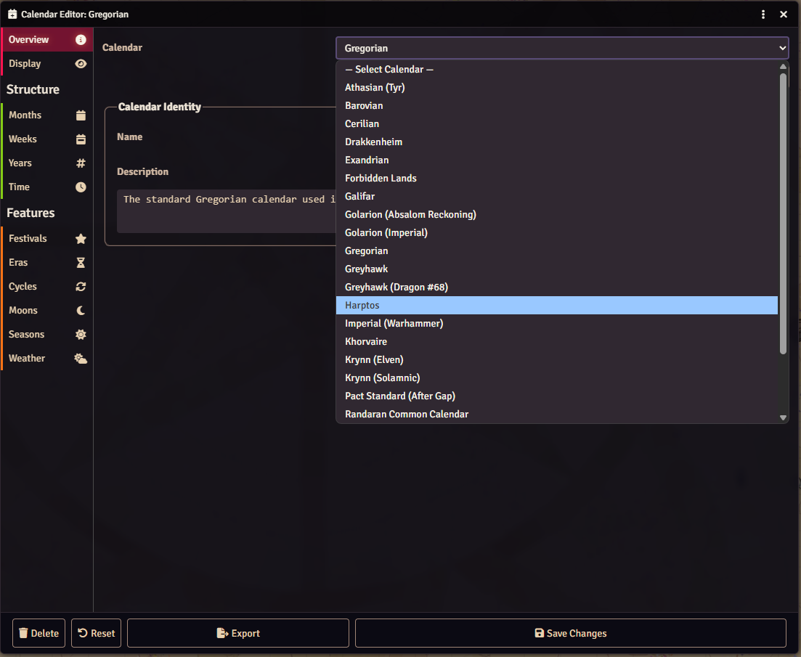
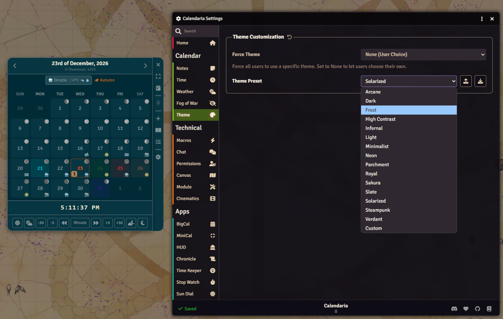

# Calendaria

A system-agnostic calendar and time tracking module for Foundry VTT. Manage in-game dates, track moon phases, schedule events, and sync scene darkness with the time of day.


&color=ff144f>)
&color=ff144f>)


[](https://discord.gg/PzzUwU9gdz)

---

## Calendar HUD

A dome-style widget with animated sky gradients, sun/moon positioning, cloud effects, and time controls. Drag it anywhere, lock position, or collapse to a minimal bar.



---

## MiniCalendar

A standalone month view widget with quick navigation, note indicators, festival highlights, and integrated time controls.



---

## Full Calendar

Full-featured calendar views for managing your campaign timeline. Switch between month, week, and year views.







---

## Notes & Events

Create journal-linked notes tied to specific dates. Supports recurrence patterns including weekday-of-month ("2nd Tuesday"), seasonal triggers, moon phase conditions, and linked events. Schedule reminder notifications via toast, chat, or dialog.



---

## Weather

27 weather presets across standard, severe, environmental, and fantasy categories. Configure climate zones with seasonal temperature ranges, or set weather manually.



---

## Moon Phases

Track multiple moons with independent cycles. Define custom phase names, set colors, and configure per-moon behavior.



---

## Calendar Editor

Build custom calendars from scratch with months, weekdays, seasons, moons, eras, and cycles. Or import from Simple Calendar, Fantasy-Calendar.com, Seasons & Stars, Simple Timekeeping, and Calendarium.



---

## Pre-Built Calendars

Calendaria ships with 15+ ready-to-use calendars:

**Official D&D Settings**: Greyhawk, Harptos (Forgotten Realms), Khorvaire (Eberron), Exandria (Critical Role), Barovia (Ravenloft), Athas (Dark Sun), Krynn (Dragonlance - Elven & Solamnic)

**Other Settings**: Golarion (Pathfinder), Cerilia (Birthright), Thyatia (Mystara), Drakkenheim, Forbidden Lands

**General**: Gregorian, plus Renescara (showcase calendar demonstrating advanced features)

---

## Theming

Customize UI colors with presets or create your own theme.



---

## Additional Features

- **Scene Darkness** — Lighting follows a day/night cycle based on world time. Configure sunrise/sunset per calendar or override per-scene.
- **Eras & Cycles** — Track historical eras with custom formatting, plus repeating cycles like zodiac signs or elemental weeks.
- **Search** — Find notes by name or content across your entire calendar.
- **Chat Timestamps** — Display in-game time on chat messages.

---

## API

Calendaria exposes a public API at `CALENDARIA.api` for macros and module integration:

```javascript
// Current date and time
const now = CALENDARIA.api.getCurrentDateTime();

// Advance time by 8 hours
await CALENDARIA.api.advanceTime({ hour: 8 });

// Get moon phase (first moon)
const phase = CALENDARIA.api.getMoonPhase(0);

// Check for active festival
const festival = CALENDARIA.api.getCurrentFestival();

// Get weather
const weather = CALENDARIA.api.getWeather();

// Search notes
const results = CALENDARIA.api.search("dragon");
```

---

## Installation

Install through Foundry's Module Manager or The Forge's Bazaar.

**Manual**: Paste this manifest URL in Foundry's Install Module dialog:

```text
https://github.com/Sayshal/calendaria/releases/latest/download/module.json
```
