# Calendaria

Your campaign's time deserves more than a number in the corner.


&color=ff144f>)


[](https://discord.gg/PzzUwU9gdz)

[](https://hosted.weblate.org/engage/calendaria/)

**[Read the Wiki](https://github.com/Sayshal/calendaria/wiki)** for guides, API docs, and tips.

---

## What You Get

**Calendar HUD** —Animated dome widget with sky gradients, sun/moon tracking, and drag-anywhere positioning. Shows current weather, date, and event indicators at a glance. Collapse it to a sleek bar when you need screen space. Scenes automatically dim at sunset and brighten at dawn.

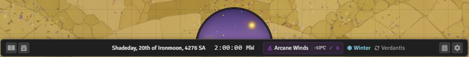

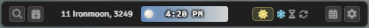

**MiniCal & BigCal** —Quick month view for daily use, plus full month/week/year views when you need the big picture. Day cells show weather pips, moon phases, and note indicators. Hover for details, click to add notes, right-click for context actions.

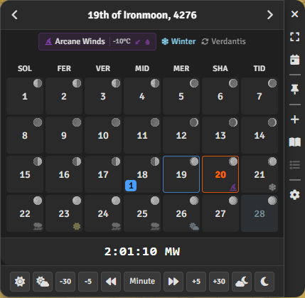

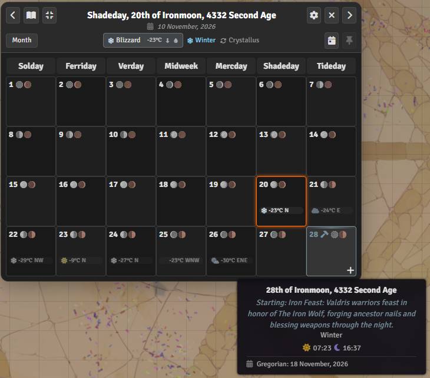

**Smart Notes** —Schedule notes with a condition engine: 41 fields, 11 operators, boolean logic (AND/OR/NAND/XOR/COUNT), and nesting up to 5 levels deep. "Every full moon", "2nd Tuesday in winter", "3 days after Festival X" —it all works. Notes support three visibility levels (Visible/Hidden/Secret), three display styles (icon/pip/banner), and multi-day durations that render as continuous bars in BigCal. Note presets define defaults and force overrides. Get reminded via chat, popup, or notification.

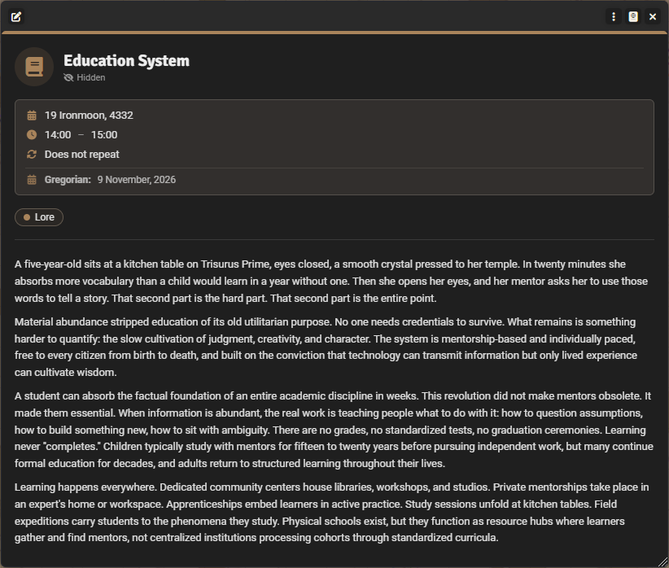

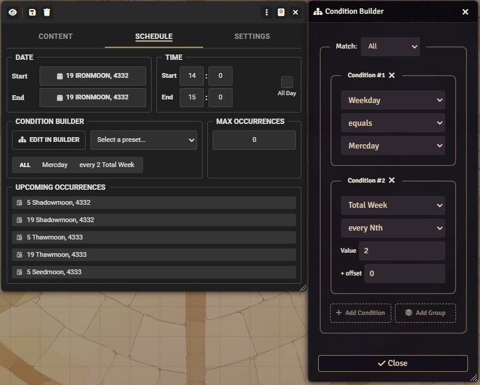

**Weather, Moons & Eclipses** —42 weather presets across standard, severe, environmental, and fantasy categories. Climate zones with per-season overrides. Intraday weather splits each day into four periods (Night/Morning/Afternoon/Evening). Multiple moons with independent cycles, randomized phase modes, and anchor phases. Eclipse calculation using a nodal window model with six subtypes (total/partial/annular solar, total/partial/penumbral lunar).

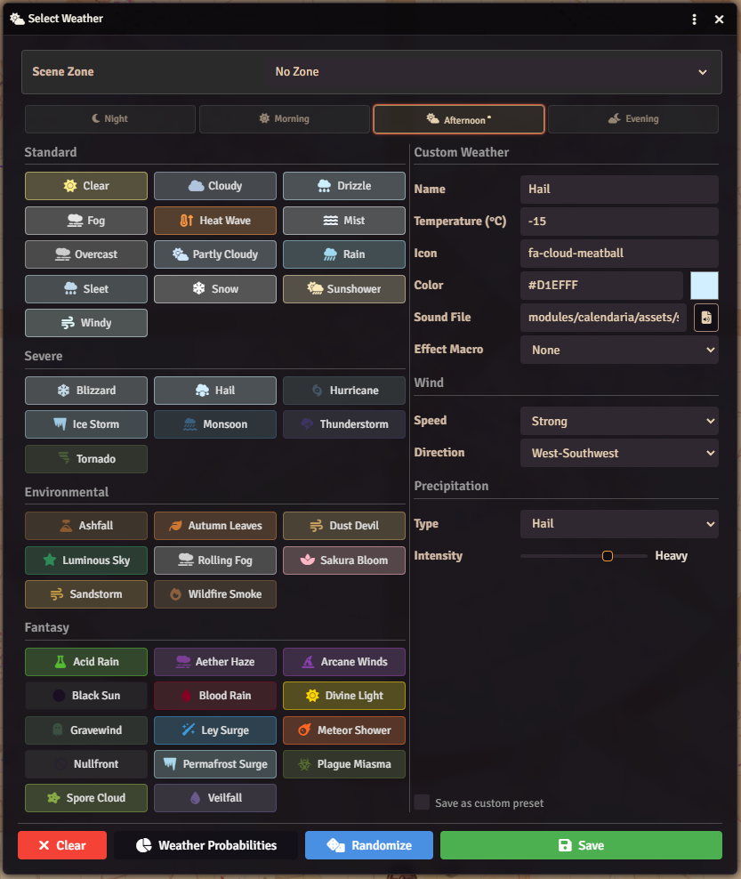

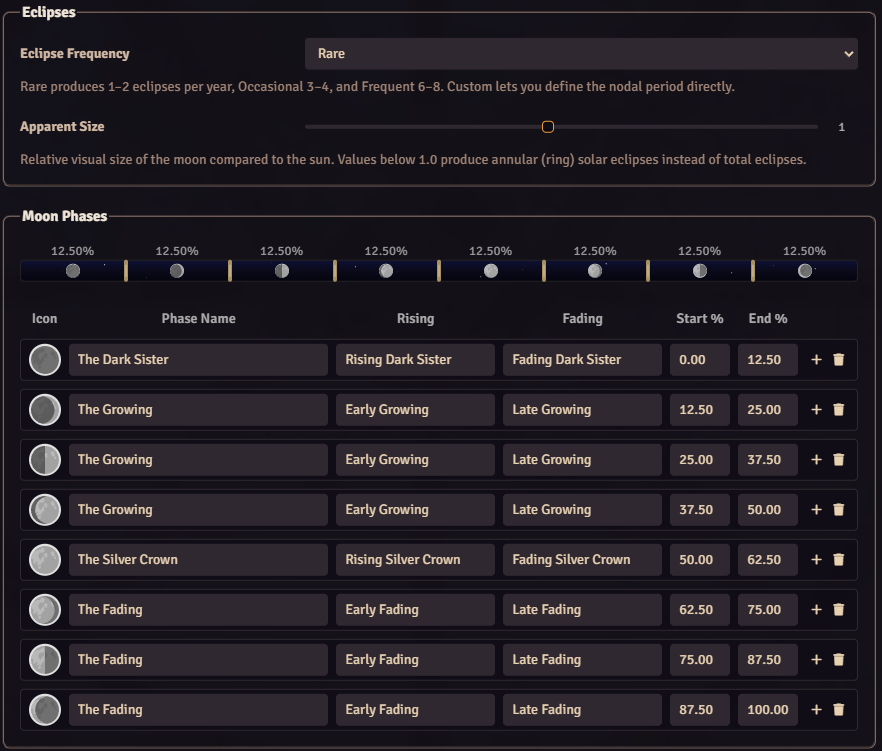

**Cinematic Time Skip** —Fullscreen animated overlay when time advances by large amounts. PixiJS-rendered sky with day/night cycle, star field, sun arc, shooting stars, and moon orbs with phase masking. A date counter ticks through intermediate days while event cards scroll past. Auto-triggers on configurable thresholds or via a dedicated button in the Set Date dialog. Syncs across all connected clients.


**Chronicle Timeline** —Infinite-scroll timeline showing notes, festivals, season banners, moon phases, and weather history. Two layouts: vertical scroll and alternating left/right timeline cards. Respects fog of war. Three depth modes: Title Only, Excerpts, and Full. Accessible from BigCal, MiniCal, HUD, context menus, toolbar, and API.

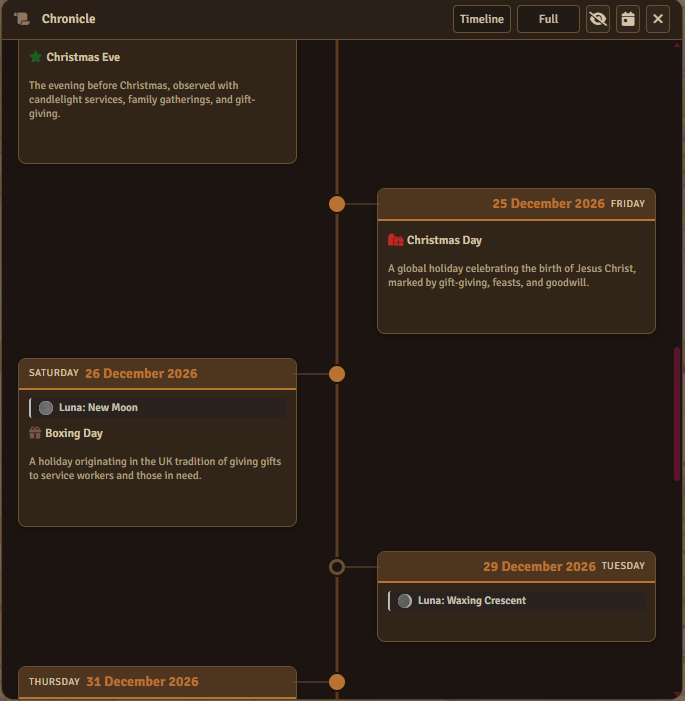

**Fog of War** —Players only see dates the GM has revealed. BigCal shows a striped overlay on fogged dates with interactions disabled. MiniCal dims fogged cells. Notes, weather, moons, and festivals are hidden on unrevealed days. Features include a Campaign Start Date lower bound, auto-reveal on day change with configurable radius, and a "Reveal Today to Here" context menu action.

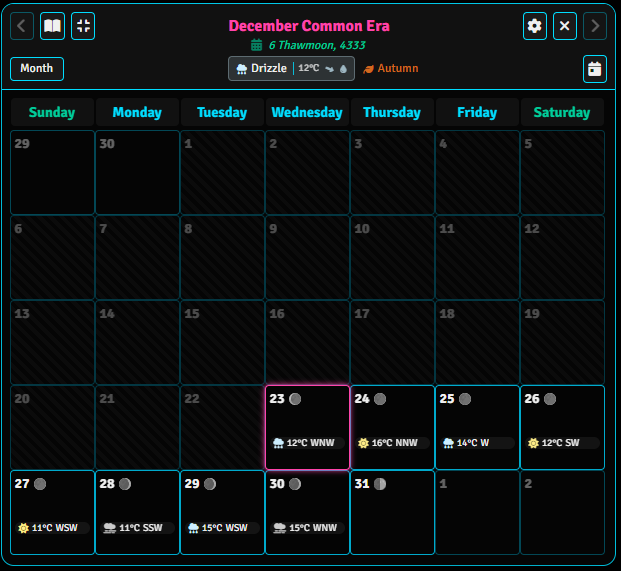

**Text Enrichers** —51 inline enrichers across 8 categories (Date & Time, Time Math, Calendar, Sun & Daylight, Moon, Weather, Notes, Composite). Embed live calendar data in journal entries, chat, and item descriptions: `[[weather]]`, `[[moon]]`, `[[countdown 1492-6-15]]`, `[[sunrise]]`, `[[season]]`. Enrichers update live when calendar data changes and support cross-calendar targeting.

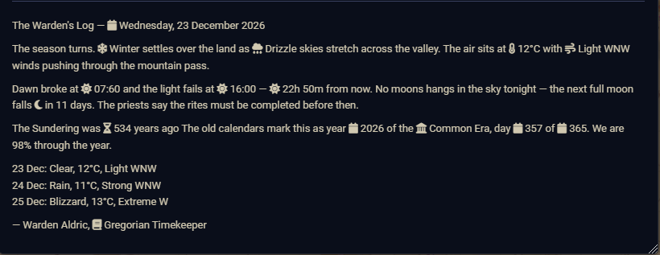

---

## Also Included

- **Note Viewer** —Standalone filter/search panel with preset, visibility, author, and text filters. Shift-click range select for bulk operations.
- **Multi-Calendar Sync** —Cross-calendar date translation via shared world time. Secondary Calendar Viewer shows equivalent dates.
- **Scene Darkness** —Automatic day/night lighting tied to sunrise and sunset. Per-scene overrides available.
- **View Permissions** —Per-widget visibility controls for all 7 widgets (BigCal, MiniCal, HUD, TimeKeeper, SunDial, Chronicle, Stopwatch).
- **Combat Behavior** —Per-user hide/restore rules for each widget during combat encounters.

---

## 21 Ready-to-Use Calendars

Forgotten Realms, Greyhawk, Eberron, Exandria, Golarion, Warhammer, Starfinder, Dark Sun, Dragonlance, and more. Or build your own with the Calendar Editor —import from Simple Calendar, Fantasy-Calendar.com, and others.

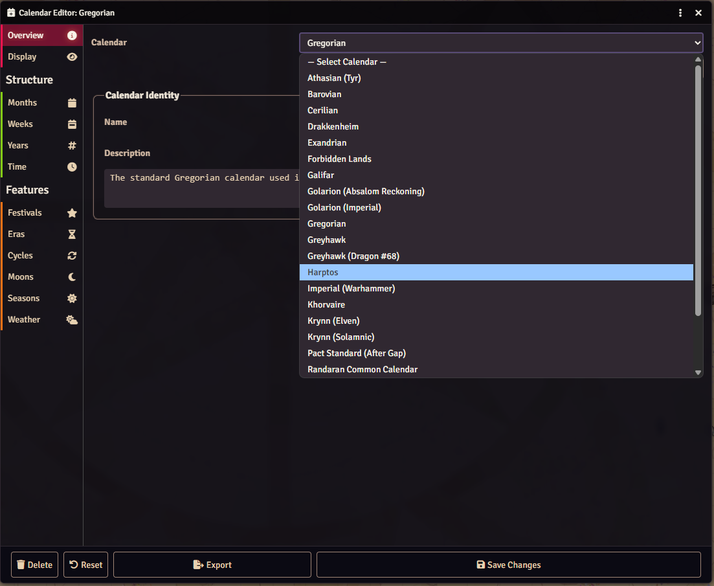

---

## Make It Yours

15 theme presets, custom color editor, and a searchable settings panel. Export your setup to share between worlds.

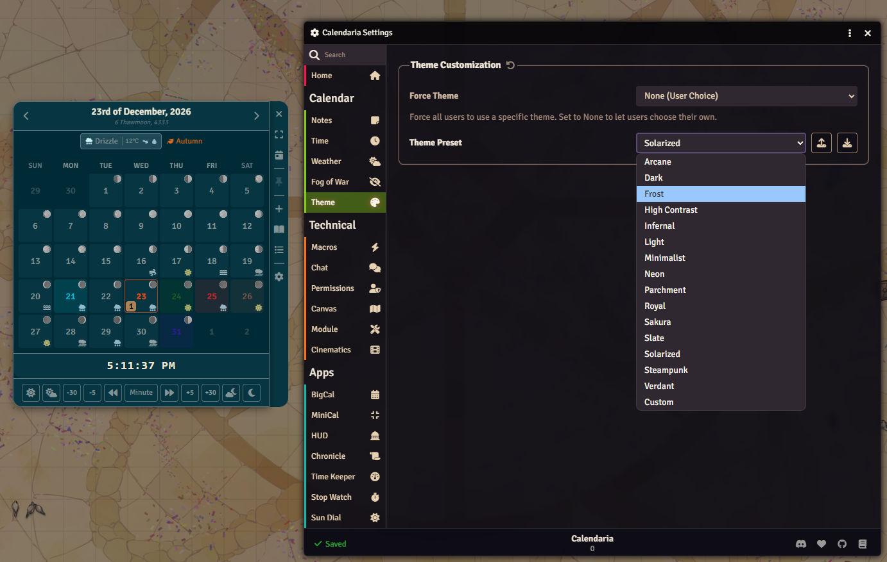

---

## For the Tinkerers

Full API at `CALENDARIA.api` for macros and module integration. Chat commands like `/date`, `/weather`, `/advance 8 hours`. Keybinds for everything.

```javascript
const now = CALENDARIA.api.getCurrentDateTime();
await CALENDARIA.api.advanceTime({ hour: 8 });
const phase = CALENDARIA.api.getMoonPhase(0);
```

---

## Installation

Find **Calendaria** in Foundry's Module Browser, or paste this manifest URL:

```
https://github.com/Sayshal/calendaria/releases/latest/download/module.json
```

Questions? Ideas? Join us on [Discord](https://discord.gg/PzzUwU9gdz) or check the [Wiki](https://github.com/Sayshal/calendaria/wiki).
